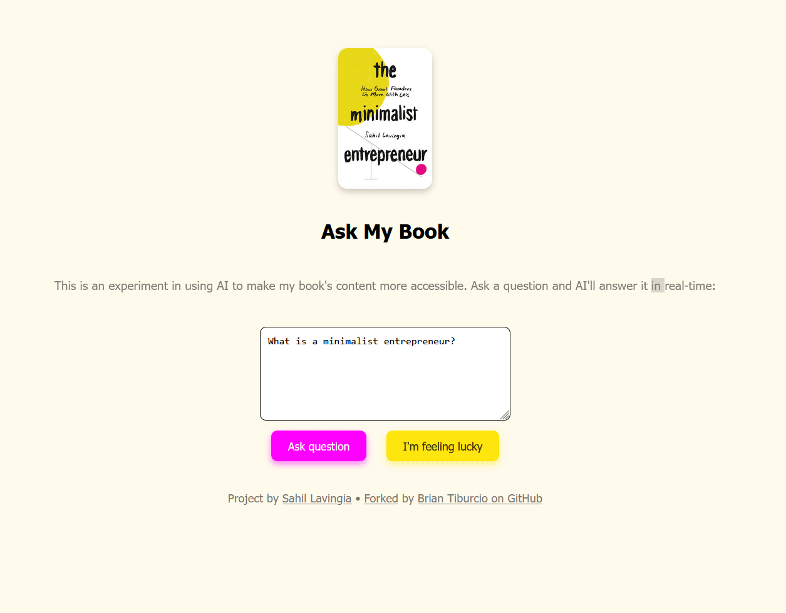

# Run
npm run dev

# Example

# Comments
Instead of implementing the model locally, the backend makes a post request to askmybook.com and sends
the new reply to the background

In the future, with a better understanding of the model, both the webserver and the model could be launched simultaneously
with either a `.bat` or a `.sh` file that creates a local API of the model that can receive the requests from the server
so that they can be displayed to the users